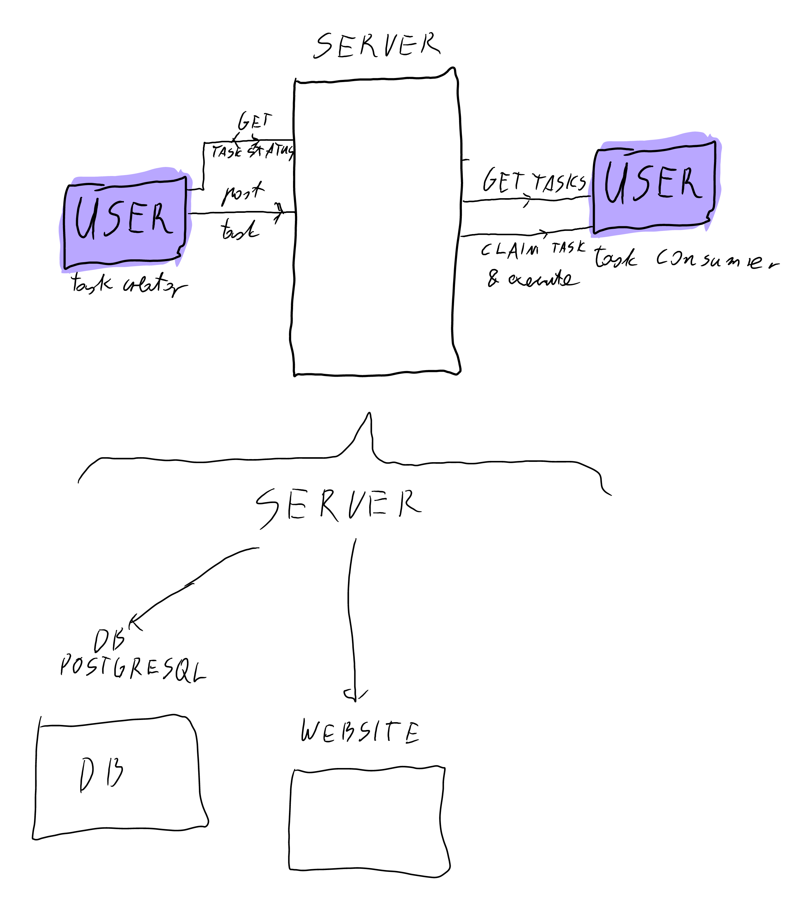

# CrowdCompute

<!--
repo name: CrowdCompute
description: An distrubuted computing platform. People can share their CPU and GPU power to help with tasks requiring heavy load.
github name:  Basileus1990
link: https://github.com/Basileus1990/CrowdCompute
email: pawelb021@gmail.com
-->

<!-- TABLE OF CONTENTS -->
## Table of Contents

* [About the Project](#about-the-project)
    * [Built With](#built-with)
    * [Architecture graph](#architecture-graph)
    * [TODO](#TODO)
    * [Ideas](#ideas)

<!-- ABOUT THE PROJECT -->
## About The Project

An distrubuted computing platform. People can share their CPU and GPU power to help with tasks requiring heavy load.
    * Task creators can upload their tasks to the platform
    * Task executors can contribute to the tasks through primarly the web browser, but also CLI tool or windowed application

### Built With
* [GO](https://golang.org/)
### Architecture graph

### TODO:
0. Planning phase
    * [X] Check how to do computations in the browser
        * create sandboxed environment and run given code there
        * In future check how to do it with GPU
    * [X] Check how to break big tasks into smaller ones, so they can be shared
        * Basically the task creator will write JS code which will be executed in the user's browser
    * [X] Create graph of the project
    
1. Frontend
    * [ ] Create basic website UI (purely functional)
        * [X] Part for adding new tasks
        * [X] Part for viewing tasks and selecting them
        * [X] executing of tasks
        * [ ] viewing results of tasks
        * [ ] make them call the server
2. Backend 
    * [ ] Create basic website backend
        * [X] Make API for adding tasks and add them (temporarily) to map in memory
        * [X] Make API for getting all tasks
        * [ ] Make API for receiving results of tasks
        * [ ] Make API for seeing results of tasks

3. Database
    * [ ] Create database
        * [X] Make it possible to add tasks to the database
        * [X] Make it possible to get tasks from the database
            * [X] Consider tasks that have the same name. Should title be primary key or something else?
        * [ ] Make it possible to add results of tasks to the database
        * [ ] Make it possible to get results of tasks from the database
    * [ ] Change varchars(n) to text as in postgres it is more efficient 

4. User system
    * https://medium.com/swlh/building-a-user-auth-system-with-jwt-using-golang-30892659cc0

#### First step
    * Make it possible to see the results of the tasks as an author
### Ideas
1. Possibly task creators could pay for the task execution. The payment would be split between the task executors.
2. Create an API for using the platform outside the browser
3. Add possiblity to use other languages than JS
4. Add possiblity to use GPU for computations
5. Add possibility to use the internet for verified task creators